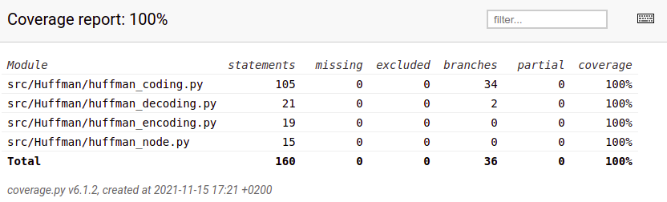

# Testausdokumentti

Pakkausalgoritmit on yksikkötestattu Unittest-sovelluskehyksellä

## Huffman
Luokkaa `HuffmanCoding` testataan [TestHuffmanCoding](https://github.com/asnabryg/Pakkausalgoritmi/blob/main/src/Huffman/tests/huffman_coding_test.py)-testiluokalla.
Luokka alustaa alussa tekstin joka pakataan ja siihen Huffman puumallin. Yksikkötestaus testaa jokaisen metodin erikseen `HuffmanCoding`-luokassa. Testeissä käytetyt tekstit ja bittiesitykset
ovat yksinkertaisia, joten niitä on helppo testata.  

Luokassa `HuffmanEncoding` testataan, että [test_file.txt](https://github.com/asnabryg/Pakkausalgoritmi/blob/main/src/Huffman/tests/test_file.txt), pakkaus onnistuu ja
luo uuden pakatuntiedoston alkuperäisen tiedoston viereen.  
Tämän jälkeen testataan `HuffmanDecoding`-luokkaa, että se purkaa pakatun tiedoston oikein ja teksti on sama kuin alkuperäinen.

## Lempel-Ziv-Welch
Luokkaa `LzwCoding` testataan [TestLempelZivWelchCoding](https://github.com/asnabryg/Pakkausalgoritmi/blob/main/src/LZW/tests/lzw_test.py)-testiluokalla.
Luokka alustaa pakattavan tekstin, jota käytetään eri lzw metodien testauksessa. Testit ovat yksin kertaisia, ja testaa kaikki metodit läpi.

## Testauskattavuus
Ohjelman tämän hetkinen (15.11.2021) testauskattavuus on 100%.

# Suorituskyky
Testauksessa käytetiin satunnaisgeneroitua Lorem ipsumia. Tiedostojen koot väliltä 512-1 048 576 tavua. Pakkausteho lasketaan kuinka monta prosenttia pienempi pakattu tiedosto on.

##  Huffman
| alkuperäinen koko (tavua) | pakattu koko (tavua) | pakkausteho (%)|
|---|---|---|
| 512 | 299 | 41.6 |
| 1 024 | 573 | 44.04 |
| 2 048 | 1 101 | 46.24 |
| 4 096 | 2 179 | 46.8 |
| 8 192 | 4 332 | 47.12 |
| 16 384 | 8 624 | 47.36 |
| 32 768 | 17 204 | 47.5 |
| 65 536 | 34 320 | 47.63 |
| 131 072 | 68 540 | 47.71 |
| 262 144 | 137 019 | 47.73 |
| 524 288 | 273 979 | 47.74 |
| 1 048 576 | 547 899 | 47.75 |

Pakkausteho nousi muutamalla prosentilla, mitä suurempi tiedoston koko oli. Näyttäisi siltä, että Huffman koodaus onnistuu hyvin n. 40-50% pienentämään tiedoston kokoa.

## Lempel-Ziv-Welch
keskeneräinen
