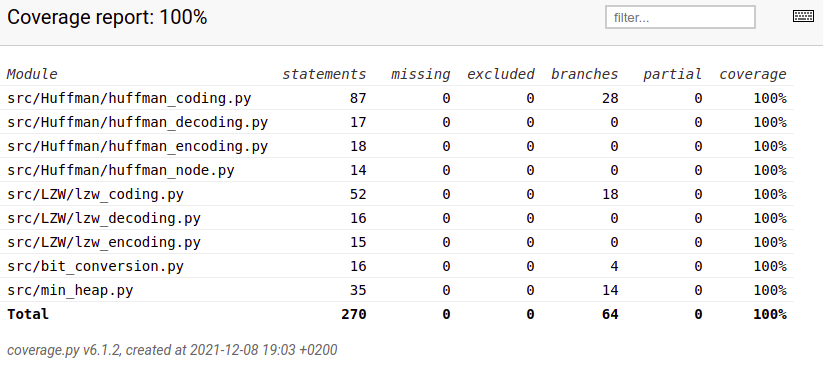

# Testausdokumentti

Pakkausalgoritmit on yksikkötestattu Unittest-sovelluskehyksellä

## Huffman
Luokkaa `HuffmanCoding` testataan [TestHuffmanCoding](https://github.com/asnabryg/Pakkausalgoritmi/blob/main/src/Huffman/tests/huffman_coding_test.py)-testiluokalla.
Luokka alustaa alussa tekstin joka pakataan ja siihen Huffman puumallin. Yksikkötestaus testaa jokaisen metodin erikseen `HuffmanCoding`-luokassa. Testeissä käytetyt tekstit ja bittiesitykset
ovat yksinkertaisia, joten niitä on helppo testata.  

Luokassa `HuffmanEncoding` testataan, että [test_file.txt](https://github.com/asnabryg/Pakkausalgoritmi/blob/main/src/Huffman/tests/test_file.txt), pakkaus onnistuu ja
luo uuden pakatuntiedoston alkuperäisen tiedoston viereen.  
Tämän jälkeen testataan `HuffmanDecoding`-luokkaa, että se purkaa pakatun tiedoston oikein ja teksti on sama kuin alkuperäinen.

## Lempel-Ziv-Welch
Luokkaa `LzwCoding` testataan [TestLempelZivWelchCoding](https://github.com/asnabryg/Pakkausalgoritmi/blob/main/src/LZW/tests/lzw_test.py)-testiluokalla.
Luokka alustaa pakattavan tekstin, jota käytetään eri lzw metodien testauksessa. Testit ovat yksin kertaisia, ja testaa kaikki metodit läpi.

## Testauskattavuus
Ohjelman tämän hetkinen (8.12.2021) testauskattavuus on 100%.

# Suorituskyky
Testauksessa käytetiin satunnaisgeneroitua Lorem ipsumia. Tiedostojen koot väliltä 512-1 048 576 tavua. Pakkausteho lasketaan kuinka monta prosenttia pienempi pakattu tiedosto on.

##  Huffman
| alkuperäinen koko (tavua) | pakattu koko (tavua) | pakkausteho (%)|
|---|---|---|
| 64 | 59 | 7.81 |
| 128 | 96 | 25.0 |
| 256 | 175 | 31.64 |
| 512 | 299 | 41.6 |
| 1 024 | 573 | 44.04 |
| 2 048 | 1 101 | 46.24 |
| 4 096 | 2 179 | 46.8 |
| 8 192 | 4 332 | 47.12 |
| 16 384 | 8 624 | 47.36 |
| 32 768 | 17 204 | 47.5 |
| 65 536 | 34 320 | 47.63 |
| 131 072 | 68 540 | 47.71 |
| 262 144 | 137 019 | 47.73 |
| 524 288 | 273 979 | 47.74 |
| 1 048 576 | 547 899 | 47.75 |

Pakkausteho nousi muutamalla prosentilla, mitä suurempi tiedoston koko oli. Näyttäisi siltä, että Huffman koodaus onnistuu hyvin n. 40-50% pienentämään tiedoston kokoa yli 512 tavun kokoisessa tiedostossa.

## Lempel-Ziv-Welch
| alkuperäinen koko (tavua) | pakattu koko (tavua) | pakkausteho (%) | pakkausaika (ms) | purkuaika (ms) |
|---|---|---|---|---|
| 64 | 66 | -3.12 | 0.283 | 0.248 |
| 128 | 115 | 10.16 | 0.312 | 0.295 |
| 256 | 206 | 19.3 | 0.404 | 0.437 |
| 512 | 398 | 22.27 | 0.702 | 0.601 |
| 1 024 | 689 | 32.71 | 1.173 | 0.959 |
| 2 048 | 1 305 | 36.28 | 1.667 | 1.463 |
| 4 096 | 2 240 | 45.31 | 3.199 | 2.489 |
| 8 192 | 4 224 | 48.44 | 5.691 | 4.228 |
| 16 384 | 7 510 | 54.16 | 10.431 | 7.167 |
| 32 768 | 12 127 | 62.99 | 18.287 | 12.246 |
| 65 536 | 21 759 | 66.8 | 34.484 | 19.169 |
| 131 072 | 40 966 | 68.75 | 67.464 | 35.577 |
| 262 144 | 79 535 | 69.66 | 129.747 | 65.366 |
| 524 288 | 155 703 | 70.3 | 258.632 | 122.917 |
| 1 048 576 | 300 897 | 71.3 | 541.388 | 235.865 |

Pienemmissä tiedostoissa Huffmanin pakkaus menetelmä vei voiton, mutta mitä suurempi tiedosto on, niin sitä paremmin LWZ menetlmä toimi. LZW algoritmi pääsi helposti yli 50% pakkaustehon, mitä Huffman algoritmi ei saavuttanut.  
Huffman algoritmi onnistui 64 tavun kokoisen tiedoston myös pienentämään 5 tavulla, kun taas LZW algoritmillä tiedoston koko suureni parilla tavulla.  

Pienempien tiedostojen pakkaaminen on usein turhaa, jos tiedostossa ei ole paljon toistoa.
  

